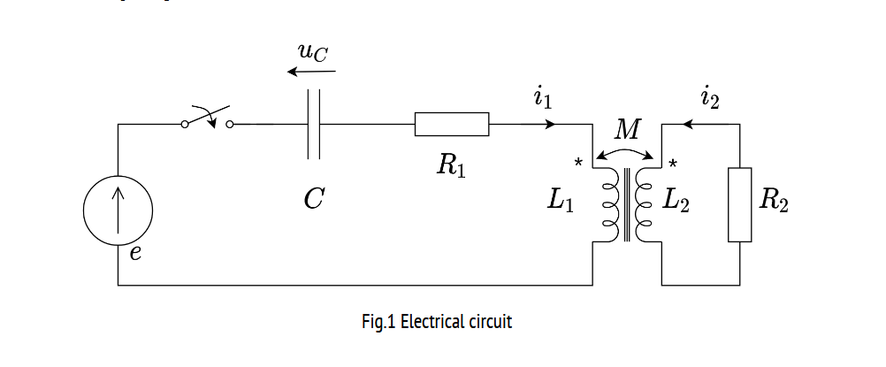

# Mutual Inductance Circuit Simulation  
This project simulates the transient response of an **RLC circuit with mutual inductance** using MATLAB.  
It includes three parts:  
1. **Solving ODEs using Numerical Methods** (Euler, Heun, RK4)  
2. **Nonlinear Mutual Inductance Analysis** (Interpolation & Approximation)  
3. **Power Dissipation Calculation** (Numerical Integration)  

## 📌 Project Overview  
The circuit consists of **two coupled inductors**, a capacitor, and resistors. The system is modeled as a set of **first-order ODEs**, which are solved using different numerical methods.  

## 📂 File Structure  
- `part1.m` → RK4 simulation for circuit response  
- `part2.m` → Nonlinear mutual inductance using interpolation  
- `part3.m` → Power dissipation calculation using numerical integration  

## ⚡ Circuit Diagram  
  
